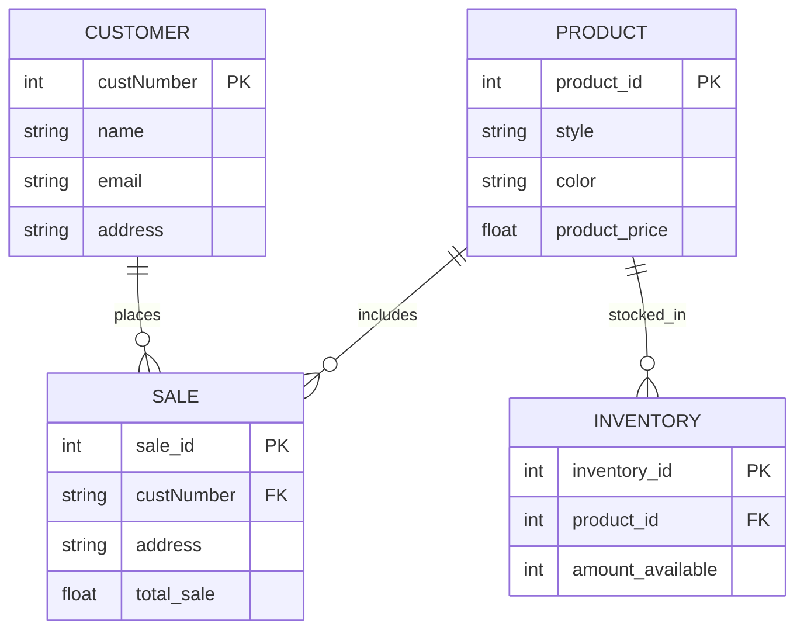

## Entity Descriptions

### Product  
This entity shows what the item is  
The Style of product  
The Color and Price

### Customer  
This entity shows the customer making the purchase  
Name, email and address of customer

### Sale. 
This entity represents the sale made by the store. 
Contains the customers number, their address and total sale

### Inventory
This entity contains the name of the products inventory ID  
Contains amount in inventory

## Relationship  

### Customer to Sale  
Customer can have multiple sales orders

### Product to Sales
There can be many products in a sale

### Product to Inventory
There can be many of the same product in Inventory

## Significance of all Entities  
Each relationship plays a vital part in running the Nike Store.  
Whether it is managing stock, customer purchase history or sales records,  
they all rely on each other to tell a broader story of store’s profits,  
insights and future planning.

